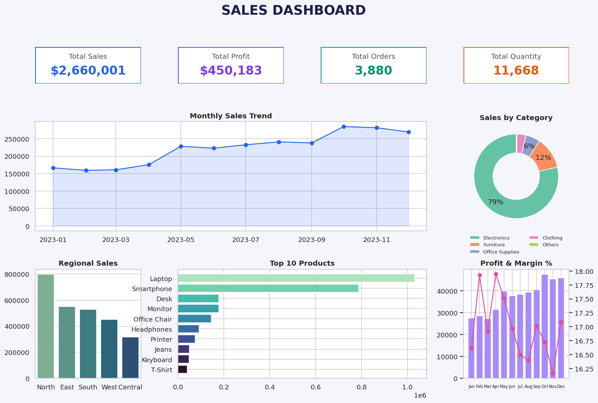
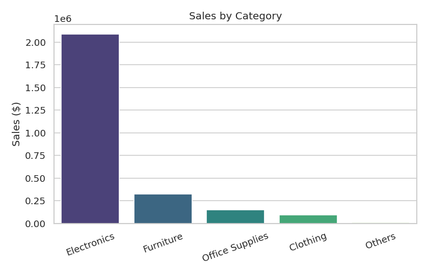
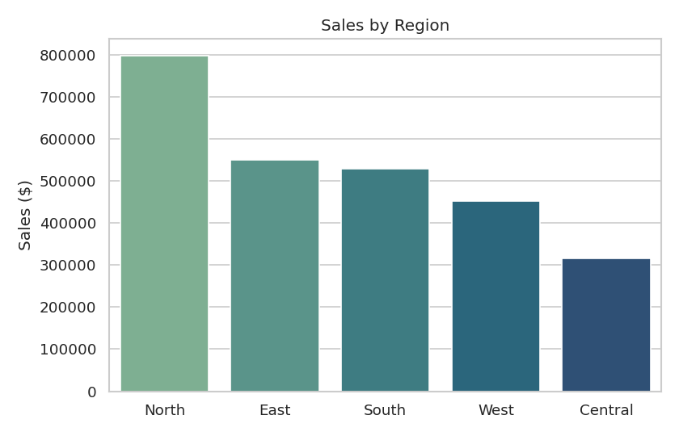
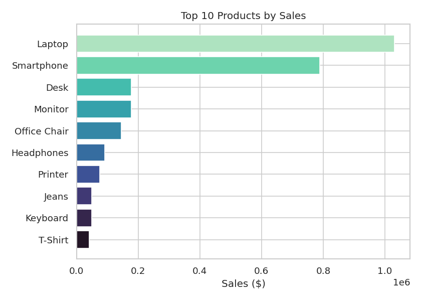
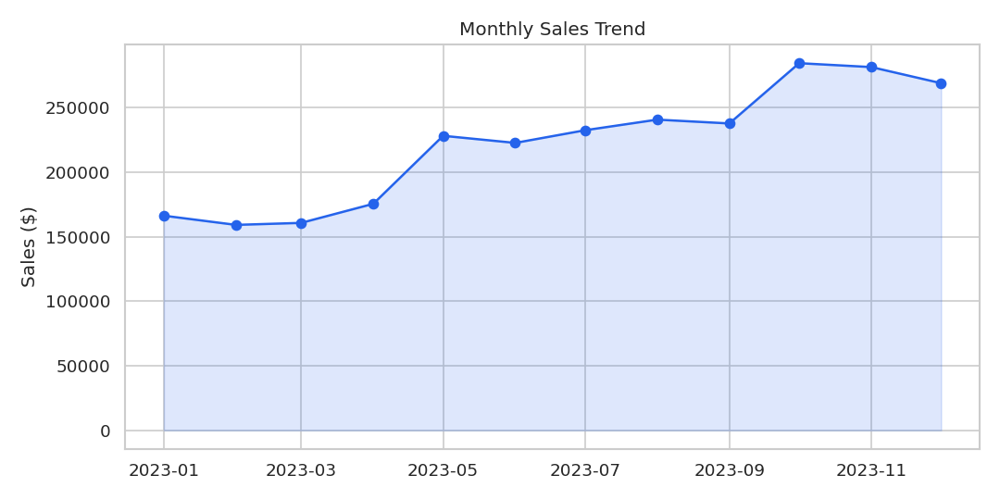

# Sales Data Analysis & Dashboard

A data science project (Data Science – Week 2) that loads, cleans and analyzes a sales
dataset, calculates business KPIs, finds trends and builds a dashboard with business insights.

## Project Overview

The project follows the complete analytics workflow: **Raw Data → Analysis → Insights → Dashboard**.
It answers the key business questions: which category, region and products sell the most, which
month is strongest, what generates the most profit, and whether sales are increasing.

## Technologies Used

-   Python
-   Pandas
-   NumPy
-   Matplotlib
-   Seaborn
-   Power BI / Excel (for the interactive dashboard using `cleaned_sales_data.csv`)

The project dependencies are listed in `requirements.txt`.

## Dataset

`sales_data.csv` is a sample dataset (3,925 raw rows, year 2023) created by
`generate_sample_data.py`, with deliberately injected duplicates, missing values and messy text
so the cleaning step is realistic. To use your own data, replace the file and keep these columns:

  Column       Description
  ------------ ---------------------
  Order ID     Unique order number
  Order Date   Date of purchase
  Customer     Customer name/ID
  Product      Product purchased
  Category     Product category
  Quantity     Units sold
  Sales        Revenue generated
  Region       Sales location
  Profit       Profit generated

## Project Workflow

1.  **Load** the sales dataset (`read_csv`).
2.  **Explore**: shape, columns, data types, statistics, missing values, duplicates.
3.  **Clean**: remove duplicates, standardize text (`" north "` → `North`), fix date types.
4.  **Handle missing data**: Sales recovered from the product's median unit price × quantity;
    missing Region/Customer labelled `Unknown` (rows are kept, not blindly deleted).
5.  **Calculate KPIs**: total sales, profit, orders, quantity, customers, average order value.
6.  **Analyze** category, region, product and monthly trends using `groupby`.
7.  **Visualize** with bar, line and donut charts.
8.  **Build the dashboard** and generate written business insights.

## Key Performance Indicators

  KPI                   Value
  --------------------- ------------
  Total Sales           $2,660,001
  Total Profit          $450,183
  Total Orders          3,880
  Total Quantity        11,668
  Unique Customers      1,396
  Average Order Value   $685.57
  Profit Margin         16.9%

## Business Insights

1.  **Highest-selling category:** Electronics – $2.09M, 78.5% of total sales.
2.  **Best region:** North – $796,879 (30.2% of sales); Central is weakest at 11.9%.
3.  **Best-selling product:** Laptop ($1.03M), followed by Smartphone ($788K).
    Lowest: Notebook Pack ($8.8K).
4.  **Best month:** October 2023 ($284,632); lowest: February 2023.
5.  **Most profitable:** Electronics (category) and Laptop (product).
6.  **Trend:** Sales are **increasing** – the last 3 months average $278K vs $162K in the first 3.
7.  **Profit margin** stays stable around 16–18% all year, so growth comes from volume, not margin.

**Recommendation:** Electronics drives the business, so protect its stock and supply. Low-revenue
categories (Clothing, Others) have higher margins (~30%) and are worth promoting. Central region
has the most room to grow.

*(Figures above are from the generated sample data. They will change with your own dataset.)*

## Visualizations







## Installation

``` bash
pip install -r requirements.txt
```

## How to Run

1.  Install the dependencies.
2.  (Optional) Generate the sample dataset: `python generate_sample_data.py`
3.  Run the analysis: `python sales_data_analysis.py`
4.  Review the console output, charts, `business_insights.txt` and `cleaned_sales_data.csv`.

## Power BI Dashboard Steps

1.  Open Power BI Desktop → **Get Data → Text/CSV** → select `cleaned_sales_data.csv`.
2.  Create cards: Total Sales, Total Profit, Distinct Count of Order ID, Sum of Quantity.
3.  Add a line chart (Order Date by month vs Sales), donut chart (Category), bar chart (Region),
    bar chart (Top 10 Products) and a combo chart (Profit + margin).
4.  Add slicers for Date, Region, Category and Product.
5.  Follow the layout in the brief: KPIs on top, trend + category in the middle, region/products/profit at the bottom.

## Project Structure

``` text
Sales-Data-Analysis/
│
├── sales_data.csv
├── cleaned_sales_data.csv
├── generate_sample_data.py
├── sales_data_analysis.py
├── sales_dashboard.png
├── category_sales.png
├── regional_sales.png
├── top_products.png
├── monthly_trend.png
├── business_insights.txt
├── requirements.txt
└── README.md
```

## Future Enhancements

-   Add year-over-year and previous-period comparisons.
-   Forecast future sales with a time-series model.
-   Customer segmentation (RFM analysis).
-   Build a Streamlit web dashboard.

## License

This project is intended for educational and learning purposes.
